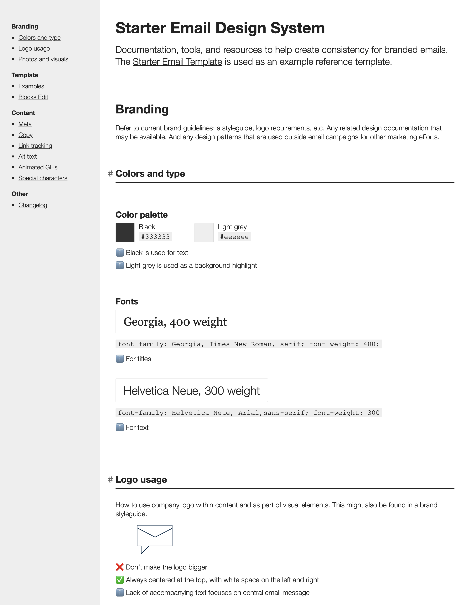

# Starter Email Design System
## A template for building a design system for your email's content production

**Use a design system to produce your emails.** The Starter Email Design System is a template you can use as a starting point for your organization's email design system. Using a design system helps your team follow branding and design guidelines and more efficiently produce emails.

## Features ##
- Single-page HTML format with navigation
- General tips for branding, writing, and using components
- Example template components, code, and guidelines
- Branding colors and fonts palette
- UTM parameters cheatsheet
- Share links cheatsheet
- Special characters tool
- Print/PDF styling
